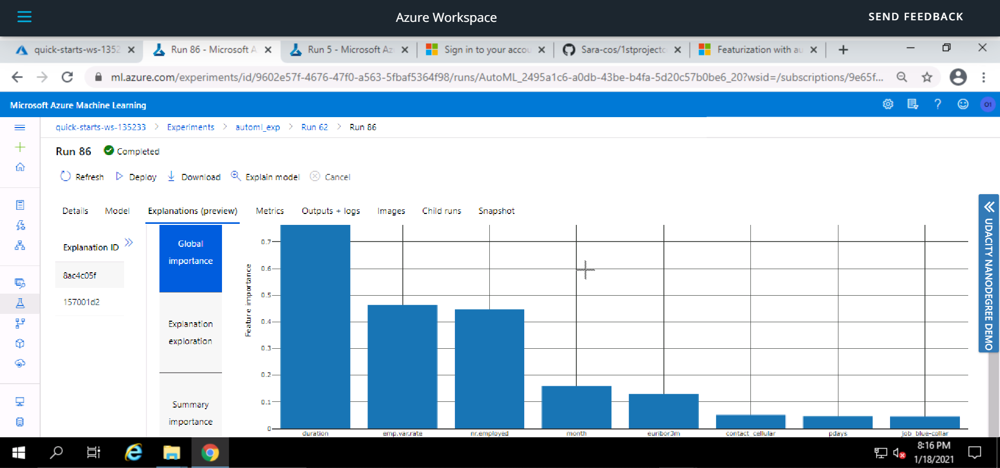

# Optimising_a_pipeline

## Overview

This project is part of the Udacity Azure ML Nanodegree. In this project, we build and optimize an Azure ML pipeline using the Python SDK and a provided Scikit-learn model. This model is then compared to an Azure AutoML run. This is the analysed report or the research summary.

## Summary

The dataset used here is a information of Portuguese Bank Marketing. The informations is based on phone calls , age, type of job, marital, education, has credit in defualt, housing, loan, type of contact , last contact, day of the week of the contact, duration in seconds, campaigns, and other variables. We want to predict if the client has subscribed a term deposit. The csv file consist of 32950 row and 21 columns. 
The csv file(https://automlsamplenotebookdata.blob.core.windows.net/automl-sample-notebook-data/bankmarketing_train.csv). 

The best performed model was Voting Ensemble obtained through AutoMl with the primary metric accuracy as '0.9163'.

## Scikit-learn Pipeline

First the workspace, experiment is created and compute configuaration is set with vm_size STANDARD_D2_V2 and max_nodes = 4. This set the infrastructure to run the projects.After that the details about the run were set, such as parameter sampling, policy and estimator SKlearn and the hyperdrive config created where the train.py file was called.In the train.py, the data from url made into TabularDataset with TabularDatasetFactory. The data was cleaned, text variables were transformed into numerical variable. The clean data was split to train and test. In the main function of train.py the arguments were added, containing maximum iteration and regulation strength.
The model choosen was Logistic Regression. The model was fit to the data and then it's accuracy was evaluated. 

The model was fit to the data and then it's accuracy was evaluated. We apply the hyperdriveconfig using RandomParameterSampling '--C':choice(0.01,0.05, 0.1, 0.5,1) and --max_iter':choice(5, 10, 20, 50, 100) This choice discrete values over a parameter search space.

Parameter sampler Random Sampling use random combinations of the hyperparameters to find best solution for the built model. Random Sampling compared has better results over Grid Search method. It is similar to other sampling methods but it requires less computing time and it is cheaper too. We used a choice sampler for the C parameter, and a choice sampler for the max_iter parameter, since it is an integer, discrete value.
Finally, the best run/performing model (highest accuracy), using the hyperparameters determined by Hyperdrive, is downloaded and registered in Azure ML. The best model generated by Hyperdrive got a 90.89 % of accuracy, with hyperparameters max_iter = 100 and regularization strength = 0.1.

The BanditPolicy was used as early stopping policy, to avoid wasting computing time when the model performance is not improving. The performance is evaluated every 2 iterations, with a slack_factor of 0.1, which represents the ratio used to calculate the distance from the best performing run. A run is a version of the model with specific values for the hyperparameters.

## AutoML

Auto Machine Learning give us the possibility to run diferent and multiple models with training jobs to find the right model. Best model was at accurary 91.63% and The Voting asemble algorithm was used. Also, we found out that the most important feature to determine the outcome of the best AutoML model is the "duration" of the phone call.

The Voting Ensemble took 2 minutes and 51 seconds.
Parameters Generated:-
 ```
Pipeline(memory=None,
         steps=[('datatransformer',
                 DataTransformer(enable_dnn=None, enable_feature_sweeping=None,
                                 feature_sweeping_config=None,
                                 feature_sweeping_timeout=None,
                                 featurization_config=None, force_text_dnn=None,
                                 is_cross_validation=None,
                                 is_onnx_compatible=None, logger=None,
                                 observer=None, task=None, working_dir=None)),
                ('prefittedsoftvotingclassifier',...
                                                                                                intercept_scaling=1,
                                                                                                l1_ratio=None,
                                                                                                max_iter=100,
                                                                                                multi_class='ovr',
                                                                                                n_jobs=1,
                                                                                                penalty='l2',
                                                                                                random_state=None,
                                                                                                solver='saga',
                                                                                                tol=0.0001,
                                                                                                verbose=0,
                                                                                                warm_start=False))],
                                                                     verbose=False))],
                                               flatten_transform=None,
                                               weights=[0.4,
                                                        0.13333333333333333,
                                                        0.06666666666666667,
                                                        0.06666666666666667,
                                                        0.13333333333333333,
                                                        0.06666666666666667,
                                                        0.13333333333333333]))],
         verbose=False)
 ```
The below screenshot shows the analysed results:

This showed that the feature called 'duration' of the phone calls mostly effected the subscription tendency.

Ensembled Algorithms:-
 Lightgbmclassifier, XGBoostclassifier, XGBoostclassifier, XGBoostclassifier, XGBoostclassifier, Logisticregression, Logisticregression

Hyperparameters
```
 "datatransformer\n",
            "{'enable_dnn': None,\n",
            " 'enable_feature_sweeping': None,\n",
            " 'feature_sweeping_config': None,\n",
            " 'feature_sweeping_timeout': None,\n",
            " 'featurization_config': None,\n",
            " 'force_text_dnn': None,\n",
            " 'is_cross_validation': None,\n",
            " 'is_onnx_compatible': None,\n",
            " 'logger': None,\n",
            " 'observer': None,\n",
            " 'task': None,\n",
            " 'working_dir': None}\n",
            "\n",
            "prefittedsoftvotingclassifier\n",
            "{'estimators': ['0', '1', '10', '7', '9', '12', '17'],\n",
            " 'weights': [0.4,\n",
            "             0.13333333333333333,\n",
            "             0.06666666666666667,\n",
            "             0.06666666666666667,\n",
            "             0.13333333333333333,\n",
            "             0.06666666666666667,\n",
            "             0.13333333333333333]}\n",
            "\n",
            "0 - maxabsscaler\n",
            "{'copy': True}\n",
            "\n",
            "0 - lightgbmclassifier\n",
            "{'boosting_type': 'gbdt',\n",
            " 'class_weight': None,\n",
            " 'colsample_bytree': 1.0,\n",
            " 'importance_type': 'split',\n",
            " 'learning_rate': 0.1,\n",
            " 'max_depth': -1,\n",
            " 'min_child_samples': 20,\n",
            " 'min_child_weight': 0.001,\n",
            " 'min_split_gain': 0.0,\n",
            " 'n_estimators': 100,\n",
            " 'n_jobs': 1,\n",
            " 'num_leaves': 31,\n",
            " 'objective': None,\n",
            " 'random_state': None,\n",
            " 'reg_alpha': 0.0,\n",
            " 'reg_lambda': 0.0,\n",
            " 'silent': True,\n",
            " 'subsample': 1.0,\n",
            " 'subsample_for_bin': 200000,\n",
            " 'subsample_freq': 0,\n",
            " 'verbose': -10}\n",
            "\n",
            "1 - maxabsscaler\n",
            "{'copy': True}\n",
            "\n",
            "1 - xgboostclassifier\n",
            "{'base_score': 0.5,\n",
            " 'booster': 'gbtree',\n",
            " 'colsample_bylevel': 1,\n",
            " 'colsample_bynode': 1,\n",
            " 'colsample_bytree': 1,\n",
            " 'gamma': 0,\n",
            " 'learning_rate': 0.1,\n",
            " 'max_delta_step': 0,\n",
            " 'max_depth': 3,\n",
            " 'min_child_weight': 1,\n",
            " 'missing': nan,\n",
            " 'n_estimators': 100,\n",
            " 'n_jobs': 1,\n",
            " 'nthread': None,\n",
            " 'objective': 'binary:logistic',\n",
            " 'random_state': 0,\n",
            " 'reg_alpha': 0,\n",
            " 'reg_lambda': 1,\n",
            " 'scale_pos_weight': 1,\n",
            " 'seed': None,\n",
            " 'silent': None,\n",
            " 'subsample': 1,\n",
            " 'tree_method': 'auto',\n",
            " 'verbose': -10,\n",
            " 'verbosity': 0}\n",
            "\n",
            "10 - sparsenormalizer\n",
            "{'copy': True, 'norm': 'max'}\n",
            "\n",
            "10 - xgboostclassifier\n",
            "{'base_score': 0.5,\n",
            " 'booster': 'gbtree',\n",
            " 'colsample_bylevel': 1,\n",
            " 'colsample_bynode': 1,\n",
            " 'colsample_bytree': 0.7,\n",
            " 'eta': 0.001,\n",
            " 'gamma': 0,\n",
            " 'learning_rate': 0.1,\n",
            " 'max_delta_step': 0,\n",
            " 'max_depth': 4,\n",
            " 'max_leaves': 7,\n",
            " 'min_child_weight': 1,\n",
            " 'missing': nan,\n",
            " 'n_estimators': 100,\n",
            " 'n_jobs': 1,\n",
            " 'nthread': None,\n",
            " 'objective': 'reg:logistic',\n",
            " 'random_state': 0,\n",
            " 'reg_alpha': 0.3125,\n",
            " 'reg_lambda': 1.875,\n",
            " 'scale_pos_weight': 1,\n",
            " 'seed': None,\n",
            " 'silent': None,\n",
            " 'subsample': 1,\n",
            " 'tree_method': 'auto',\n",
            " 'verbose': -10,\n",
            " 'verbosity': 0}\n",
            "\n",
            "7 - sparsenormalizer\n",
            "{'copy': True, 'norm': 'l2'}\n",
            "\n",
            "7 - xgboostclassifier\n",
            "{'base_score': 0.5,\n",
            " 'booster': 'gbtree',\n",
            " 'colsample_bylevel': 1,\n",
            " 'colsample_bynode': 1,\n",
            " 'colsample_bytree': 0.5,\n",
            " 'eta': 0.1,\n",
            " 'gamma': 0,\n",
            " 'learning_rate': 0.1,\n",
            " 'max_delta_step': 0,\n",
            " 'max_depth': 6,\n",
            " 'max_leaves': 15,\n",
            " 'min_child_weight': 1,\n",
            " 'missing': nan,\n",
            " 'n_estimators': 100,\n",
            " 'n_jobs': 1,\n",
            " 'nthread': None,\n",
            " 'objective': 'reg:logistic',\n",
            " 'random_state': 0,\n",
            " 'reg_alpha': 0,\n",
            " 'reg_lambda': 2.0833333333333335,\n",
            " 'scale_pos_weight': 1,\n",
            " 'seed': None,\n",
            " 'silent': None,\n",
            " 'subsample': 1,\n",
            " 'tree_method': 'auto',\n",
            " 'verbose': -10,\n",
            " 'verbosity': 0}\n",
            "\n",
            "9 - sparsenormalizer\n",
            "{'copy': True, 'norm': 'l2'}\n",
            "\n",
            "9 - xgboostclassifier\n",
            "{'base_score': 0.5,\n",
            " 'booster': 'gbtree',\n",
            " 'colsample_bylevel': 1,\n",
            " 'colsample_bynode': 1,\n",
            " 'colsample_bytree': 0.9,\n",
            " 'eta': 0.3,\n",
            " 'gamma': 0,\n",
            " 'learning_rate': 0.1,\n",
            " 'max_delta_step': 0,\n",
            " 'max_depth': 9,\n",
            " 'max_leaves': 0,\n",
            " 'min_child_weight': 1,\n",
            " 'missing': nan,\n",
            " 'n_estimators': 25,\n",
            " 'n_jobs': 1,\n",
            " 'nthread': None,\n",
            " 'objective': 'reg:logistic',\n",
            " 'random_state': 0,\n",
            " 'reg_alpha': 0,\n",
            " 'reg_lambda': 0.7291666666666667,\n",
            " 'scale_pos_weight': 1,\n",
            " 'seed': None,\n",
            " 'silent': None,\n",
            " 'subsample': 0.9,\n",
            " 'tree_method': 'auto',\n",
            " 'verbose': -10,\n",
            " 'verbosity': 0}\n",
            "\n",
            "12 - minmaxscaler\n",
            "{'copy': True, 'feature_range': (0, 1)}\n",
            "\n",
            "12 - logisticregression\n",
            "{'C': 2.559547922699533,\n",
            " 'class_weight': None,\n",
            " 'dual': False,\n",
            " 'fit_intercept': True,\n",
            " 'intercept_scaling': 1,\n",
            " 'l1_ratio': None,\n",
            " 'max_iter': 100,\n",
            " 'multi_class': 'ovr',\n",
            " 'n_jobs': 1,\n",
            " 'penalty': 'l2',\n",
            " 'random_state': None,\n",
            " 'solver': 'saga',\n",
            " 'tol': 0.0001,\n",
            " 'verbose': 0,\n",
            " 'warm_start': False}\n",
            "\n",
            "17 - maxabsscaler\n",
            "{'copy': True}\n",
            "\n",
            "17 - logisticregression\n",
            "{'C': 24.420530945486497,\n",
            " 'class_weight': None,\n",
            " 'dual': False,\n",
            " 'fit_intercept': True,\n",
            " 'intercept_scaling': 1,\n",
            " 'l1_ratio': None,\n",
            " 'max_iter': 100,\n",
            " 'multi_class': 'ovr',\n",
            " 'n_jobs': 1,\n",
            " 'penalty': 'l2',\n",
            " 'random_state': None,\n",
            " 'solver': 'saga',\n",
            " 'tol': 0.0001,\n",
            " 'verbose': 0,\n",
            " 'warm_start': False}\n",
            "\n"
          ]
        }
      ],
      "execution_count": 23,
      "metadata": {
        "collapsed": true,
        "jupyter": {
          "source_hidden": false,
          "outputs_hidden": false
        },
        "nteract": {
          "transient": {
            "deleting": false
          }
        },
        "gather": {
          "logged": 1611000826004
        }
      }
    }
  ],
  "metadata": {
    "kernel_info": {
      "name": "python3"
    },
    "kernelspec": {
      "name": "python3",
      "language": "python",
      "display_name": "Python 3"
    },
    "language_info": {
      "name": "python",
      "version": "3.6.9",
      "mimetype": "text/x-python",
      "codemirror_mode": {
        "name": "ipython",
        "version": 3
      },
      "pygments_lexer": "ipython3",
      "nbconvert_exporter": "python",
      "file_extension": ".py"
    },
    "nteract": {
      "version": "nteract-front-end@1.0.0"
    }
  },
  "nbformat": 4,
  "nbformat_minor": 2
  }
  

```


## Pipeline Comparison

The AutoML model experiment was executed and controlled within the same Jupyter notebook as the Logistic Regression/Hyperdrive one. The same dataset was used, cleaned, one-hot encoded, and split. An experiment and computing cluster, similar to the Logistic Regression model, were setup. The Accuracy was used as benchmarking metric. The AutoML experiment was configured to run a classification task, with a maximum of 4 concurrent iterations (the computing cluster has 4 nodes), and 5 cross validation groups. Finally, the best performing model was registered in Azure ML, and the computing cluster was deleted.

The best model was with 91.63% accuracy, as we know that AutoML uses multiple models instead of a single one, to classify an instance or predict an outcome. The biggest difference is that the Hyperdrive experiment uses only an algorithm and searches for the best hyperparameters, while the AutoML experiment tries different algorithms and hyperparameters. 

## Future Work

1. Use the Azure ML Explainability tool to understand why the models yield the results they do.
2. Deeplearning in AutoML configuration could improve the accuracy of the model and trying other compute target.
3. Use Grid and Bayesian sampling to determine the hyperparameters for the Hyperdrive experiment. It could be more expensive, but it could generate a better model.
4. We can avoid an early stopping policy so the experiment can run longer. Maybe it will find a better model. (If the budget is not a constrain).
5. Deploy the model as inference endpoints.

## Proof of cluster clean up


